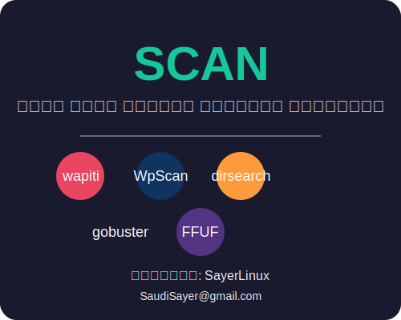

# Scan - أداة قوية وثورية لاختبار الاختراق

<p align="center">
  
</p>
## الوصف
Scan هي أداة قوية تجمع بين مجموعة من أدوات اختبار الاختراق الشهيرة في مكان واحد:
- wapiti
- WpScan
- dirsearch
- gobuster
- FFUF

## المتطلبات
- Python 3.x
- pip (مدير حزم Python)
- Ruby (لـ WPScan)
- Go (لـ gobuster و FFUF)

## تعليمات التثبيت

### على نظام Windows

1. تثبيت wapiti:
```bash
pip install wapiti3
```

2. تثبيت WPScan:
- قم بتحميل وتثبيت Ruby من [موقع Ruby الرسمي](https://rubyinstaller.org/downloads/)
- افتح موجه الأوامر وقم بتنفيذ:
```bash
gem install wpscan
```

3. تثبيت dirsearch:
```bash
pip install dirsearch
```

4. تثبيت gobuster:
- قم بتحميل وتثبيت Go من [موقع Go الرسمي](https://golang.org/dl/)
- افتح موجه الأوامر وقم بتنفيذ:
```bash
go install github.com/OJ/gobuster/v3@latest
```

5. تثبيت FFUF:
```bash
go install github.com/ffuf/ffuf@latest
```

### على نظام Kali Linux
```bash
sudo apt update && sudo apt install -y wapiti wpscan dirsearch gobuster ffuf
```

### على نظام Ubuntu/Debian
```bash
# تثبيت wapiti
pip install wapiti3

# تثبيت WPScan
gem install wpscan

# تثبيت dirsearch
pip install dirsearch

# تثبيت gobuster
sudo snap install gobuster

# تثبيت FFUF
go install github.com/ffuf/ffuf@latest
```

## طريقة الاستخدام

### الأمر الأساسي:
```bash
python scan.py -u http://example.com
```

### الخيارات المتاحة:
- `-u` أو `--url`: عنوان URL المستهدف (مطلوب)
- `-o` أو `--output`: مجلد حفظ النتائج (اختياري، الافتراضي: results)
- `-w` أو `--wordlist`: مسار قائمة الكلمات المستخدمة (اختياري)
- `--skip-wordlist-create`: تخطي إنشاء ملف الكلمات الافتراضي
- `--skip-check`: تخطي التحقق من وجود الأدوات

### تشغيل أدوات محددة:
- `--wapiti`: تشغيل wapiti فقط
- `--wpscan`: تشغيل WPScan فقط
- `--dirsearch`: تشغيل dirsearch فقط
- `--gobuster`: تشغيل gobuster فقط
- `--ffuf`: تشغيل FFUF فقط

## المخرجات
يتم حفظ نتائج كل أداة في مجلد منفصل مع اسم الأداة، بالإضافة إلى ملف مجمع يحتوي على جميع النتائج.

## المبرمج
- الاسم: SayerLinux
- البريد الإلكتروني: SaudiSayer@gmail.com - أداة قوية وثورية لاختبار الاختراق

<p align="center">
  
</p>

## نظرة عامة

Scan هي أداة قوية وثورية تجمع بين أدوات اختبار الاختراق الشائعة في واجهة موحدة وسهلة الاستخدام. تم تطويرها بواسطة SayerLinux، وتهدف إلى تبسيط عملية اختبار الاختراق من خلال دمج الأدوات التالية:

- **wapiti**: أداة فحص ثغرات تطبيقات الويب
- **WpScan**: أداة فحص أمان WordPress
- **dirsearch**: أداة اكتشاف المسارات والملفات
- **gobuster**: أداة اكتشاف المسارات والملفات بسرعة عالية
- **FFUF**: أداة فحص الويب المرنة والسريعة

## المميزات

- واجهة موحدة لأدوات متعددة
- تقارير منظمة ومرتبة زمنياً
- خيارات تخصيص متنوعة
- دعم تشغيل أدوات محددة أو جميع الأدوات
- حفظ النتائج في مجلدات منظمة
- **حفظ النتائج تلقائياً في ملف واحد شامل**

## المتطلبات

يجب تثبيت الأدوات التالية قبل استخدام Scan:

- Python 3.6 أو أحدث
- wapiti
- wpscan
- dirsearch
- gobuster
- ffuf

## التثبيت

1. قم بتنزيل المشروع:

```bash
git clone https://github.com/SayerLinux/Scan.git
cd Scan
```

2. تأكد من تثبيت جميع الأدوات المطلوبة:

```bash
python scan.py --check-tools
```

## الاستخدام

### الاستخدام الأساسي

```bash
python scan.py -u https://example.com
```

هذا سيقوم بتشغيل جميع الأدوات المدمجة على الموقع المستهدف.

### خيارات متقدمة

```bash
python scan.py -u https://example.com -o custom_output -w /path/to/wordlist.txt --wapiti --dirsearch
```

هذا سيقوم بتشغيل wapiti و dirsearch فقط، مع تخصيص مجلد الإخراج وقائمة الكلمات.

### جميع الخيارات

```
الاستخدام: scan.py [-h] -u URL [-o OUTPUT] [-w WORDLIST] [--wapiti] [--wpscan] [--dirsearch] [--gobuster] [--ffuf]

الخيارات:
  -h, --help            عرض رسالة المساعدة هذه والخروج
  -u URL, --url URL     عنوان URL المستهدف
  -o OUTPUT, --output OUTPUT
                        مجلد الإخراج (الافتراضي: results)
  -w WORDLIST, --wordlist WORDLIST
                        قائمة الكلمات للاستخدام مع gobuster و FFUF
  --wapiti              تشغيل wapiti فقط
  --wpscan              تشغيل WpScan فقط
  --dirsearch           تشغيل dirsearch فقط
  --gobuster            تشغيل gobuster فقط
  --ffuf                تشغيل FFUF فقط
```

## مثال للنتائج

بعد تشغيل الأداة، سيتم إنشاء مجلد للنتائج يحتوي على ملفات تقارير لكل أداة تم تشغيلها، بالإضافة إلى ملف شامل يجمع جميع النتائج:

```
results_20230615_120000/
├── wapiti_results.html
├── wpscan_results.txt
├── dirsearch_results.txt
├── gobuster_results.txt
├── ffuf_results.json
└── combined_results.txt  # ملف النتائج المجمعة
```

### ملف النتائج المجمعة

يحتوي ملف `combined_results.txt` على جميع نتائج الفحص من جميع الأدوات المستخدمة في مكان واحد، مما يسهل مراجعة النتائج وتحليلها. يتضمن الملف:

- معلومات عن الهدف وتاريخ الفحص
- قائمة بالأدوات المستخدمة
- نتائج كل أداة بشكل منظم ومفصل
- معلومات المبرمج

## المساهمة

نرحب بالمساهمات! يرجى إرسال طلبات السحب أو فتح مشكلات للتحسينات المقترحة.

## الترخيص

تم ترخيص هذا المشروع تحت رخصة MIT.

## المؤلف

- **SayerLinux**
- البريد الإلكتروني: SaudiSayer@gmail.com
